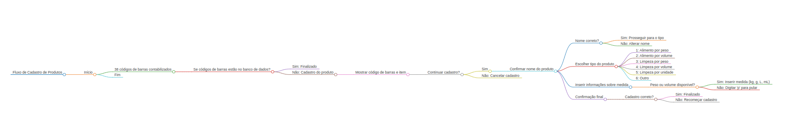

## Details

Web Application for a volunteer project called Operação Natal (Operation Christmas) which can be found at @operacaonatalcps on Instagram.

Operacao Natal goals:
- To help kids institutes around Campinas - São Paulo in Brazil
- Provide those institutes with food, hygiene and others goods
- Recreational activities for kids

The goal was:
- To provide an interface acessible on smartphones via browser (made possible using AWS)
- Users can input how much kg and which kind of was donated (for example, rice, beans, pasta, etc.)
- Separate data into excel spreadsheets

## Instructions

To run this project, your first need to:

1. Create a python environemnt and install libraries

`python3 -m venv .env`

`source .env/bin/activate`

`pip install -r requirements.txt`

2. Then you can run the streamlit application

`streamlit run main.py`

